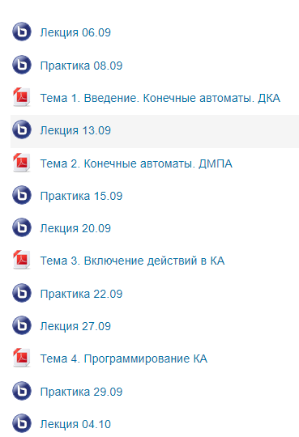

# Лабораторная работа 1 вариант 2 

**DMAP.js** - это сам автомат

**index.js** - тут инициализация конечного автомата, таблицы переходов и встроенных действий

**graf.png** - тут версии графа перехода но нет последнего последний можно построить по таблице переходов

Чтобы все понимать что в лабе происходит надо посмотреть

Чтобы понять оптимизации надо открыть методичку на 31 странице